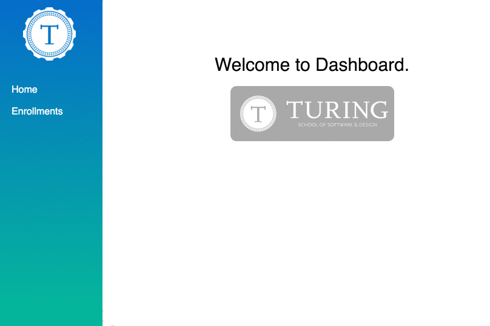

# Turing Dashboard

Welcome!

A React data-visualization application and interface to serve up beautifully, efficiently displayed Turing operational data. This app is to serve the informational needs of the Turing Operations staff and all other parties who might be interested in viewing Turing Data.

## Project Status

This project is still in progress. It is a joint, continuing effort between other data-focused internal teams and Dashboard, the client side app.

Currently, the only data that is visualized is the current enrollment statistics for the next three(3) upcoming cohorts. It displays enrollments as a donut chart, which when filled, indicates a full cohort.

## Project Screen Shot(s)

#### Example:   

## Installation and Setup Instructions

#### Example:  

Clone down this repository. You will need `node` and `npm` installed globally on your machine.  

Installation:

`npm install`  

To Run Test Suite:  

`npm test`  

To Start Server:

`npm start`  

To Visit App:

`localhost:3000'  

## Reflection

    This project was pitched by Jeff Casimir at the beginning of the personal projects, as a data-visualization app that would be a team working in conjunction with a team of mod 4 back end. I set out to build React hub for data visualization, which included *useful* statistics that would be actively used by the operations team, at the very least. This project was not particularly challenging in a technical sense, but working with a cross-cohort team was an interesting challenge in a project management sort of sense. I learned a lot about taking matters into my own hands when faced with roadblocks from other individuals or situations. The backend team I was working with was not quite able to provide me as much data as I needed in order to visualize it, so I visualized what I could, and polished it up as much as possible, and moved onto another project.

    This project was initially created with Create-React-App, a command line tool to create a react application included with webpack and other testing libraries. After a lot of research into different libraries for visualization, I ended up using Victory.js, which is a d3-react wrapper around charting components to allow for flexibility in what the charts look like and how they animate. I found it to be super simple and easy to implement once I figured out what each component property did.

    As for hosting, I worked with my back end team to get the Dashboard hosted on Heroku with continuious integration via TravisCI.

    Overall, I think the project has a great platform for growth once I get more data to visualize, working together with the operations team.
